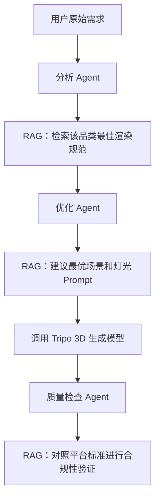

# easy3d：生产级 RAG 知识库建设与业务集成方案

基于对 `easy3d` 项目代码库的分析，以下是关于如何将当前的 RAG（检索增强生成）系统演进为生产级服务，并深度赋能业务流程的详细方案。

## 1. 当前架构评估

- **检索流程**：采用了标准的二阶段检索（Qdrant 向量检索 + `qwen-plus` 模型重排序）。
- **知识储备**：拥有 ~130 条高质量的手动录入知识，涵盖品类规范、场景设计、灯光参数及平台标准。
- **集成方式**：已对外提供语义搜索（Search）、智能问答（Ask）和展示建议（Suggest）三个核心 API。

> [!NOTE]
> 目前是一套非常扎实的 MVP（最小可行性内容）。二阶段检索的设计保证了初期的精度，但在响应延迟、由于全向量匹配带来的长尾关键词缺失、以及自动化数据更新方面还有提升空间。

---

## 2. 生产级技术强化路径

### A. 混合检索（Hybrid Search）
目前 100% 依赖向量检索。在生产环境中，向量检索有时会由于距离计算误差，错过精确的关键词匹配（如产品型号 "iPhone 16 Pro"）。
- **方案**：在 [lib/rag/qdrant.ts](file:///Users/bingo/.openclaw/workspace/projects/easy3d/lib/rag/qdrant.ts) 中引入 **Sparse Vector**（稀疏向量）或辅助的 **BM25** 关键词索引。
- **融合算法**：使用 **RRF (Reciprocal Rank Fusion)** 对语义分数和关键词分数进行加权融合，确保搜索“既懂意思，又准词语”。

### B. 专用重排序模型（Reranker）
目前使用 `qwen-plus` 大模型进行重排，虽然精度高，但延迟大（1-2秒）且成本较高。
- **方案**：引入专用的 **Cross-Encoder 重排模型**（如 BGE-Reranker）。
- **改进点**：专有模型在排序任务上更敏捷，响应时间可降至毫秒级，同时更好地过滤掉向量检索阶段召回的低质量结果。

### C. 自动化知识工程管道
- **方案**：从手动维护 [knowledge-base.ts](file:///Users/bingo/.openclaw/workspace/projects/easy3d/scripts/knowledge-base.ts) 转向动态摄取。
- **技术细节**：引入 **语义切片 (Semantic Chunking)**，不再死板地按 500 字切分，而是根据上下文语义边界断句。这对于处理复杂的《电商展示规范 PDF》至关重要。

### D. RAG 评估体系 (RAGAS)
- **方案**：引入自动化评估指标。
    - **忠实度 (Faithfulness)**：回答是否完全基于检索到的上下文，防止 AI 幻觉。
    - **答案相关度 (Answer Relevance)**：回答是否真正解决了用户的问题。
    - **检索精度 (Context Precision)**：搜出来的资料到底对不对。

---

## 3. 业务集成与赋能方案

RAG 最大的业务价值在于将其深度嵌入到 `easy3d` 的 **3D 生成 Agent 工作流**中。

### 工作流集成示意图

### 核心业务用例

1. **智能 Prompt 增强**：
   - 不再让用户写复杂的 3D 术语。当用户输入“口红”时，RAG 自动从知识库提取“45度侧光、柔光箱、金属质感 PBR 参数”，注入给生成模型。
   - **价值**：极大提升非专业用户的出图质量。

2. **多平台标准适配器**：
   - 不同电商平台（小红书、亚马逊、得物）对 3D 模型的面数、贴图格式有严格要求。
   - **价值**：RAG 自动调取 `platform_spec` 知识，指导 Agent 在生成后进行自动导出和格式校验。

3. **材质参数精确化**：
   - 知识库中存储常见材质（如磨砂铝、钢化玻璃）的高性能渲染参数（Roughness, Metalness）。
   - **价值**：生成 Agent 在优化提示词时能够给出具体的数值建议，使生成的模型质感更接近真实效果。

---

## 4. 实施路线图

1. **短期（快速见效）**：
   - 将 [suggestDisplay](file:///Users/bingo/.openclaw/workspace/projects/easy3d/lib/rag/search.ts#85-133) 服务集成进 [test-agent-workflow4.ts](file:///Users/bingo/.openclaw/workspace/projects/easy3d/scripts/test-agent-workflow4.ts) 测试脚本中。
   - 在 UI 界面增加“参考来源”展示，增强知识库透明度。

2. **中期（性能提升）**：
   - 切换到 Qdrant 的分布式索引，支持更多数据。
   - 引入专用重排模型，将端到端检索延迟压进 500ms 以内。

3. **长期（规模化）**：
   - 建立自动化爬虫监控主流电商设计博客和官方文档，自动更新知识库。
   - 引入用户反馈闭环：用户对方案的点赞/踩将自动反馈给重排权重，实现系统“越用越聪明”。
